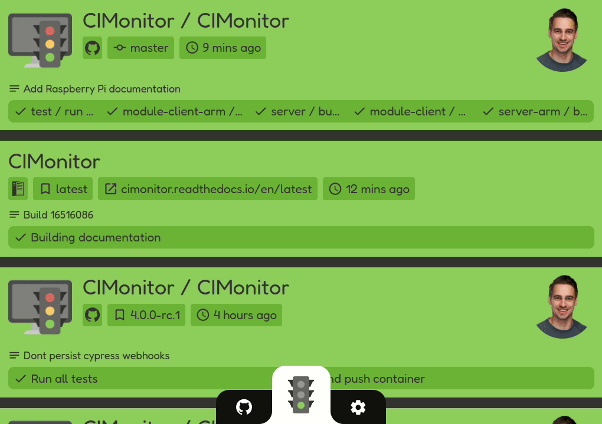

#  CIMonitor v4

CIMonitor is a place where all your CI statuses come together. Check if all tests have passed, and if
deployments are successful. All in one overview. This is all done via **webhooks**, so no complex configuration.
[Get started](https://cimonitor.readthedocs.io/en/latest/getting-started)!

## Supported webhooks

-   [GitHub](https://cimonitor.readthedocs.io/en/latest/webhook/github/)
-   [GitLab](https://cimonitor.readthedocs.io/en/latest/webhook/gitlab/)
-   [Read the Docs](https://cimonitor.readthedocs.io/en/latest/webhook/readthedocs/)

## Example

# Getting started

The easiest and quickest way to run CIMonitor is via docker. But there are other options available for you. Check the
options below in the documentation:

-   [docker](https://cimonitor.readthedocs.io/en/latest/run/docker/)
-   [kubernetes](https://cimonitor.readthedocs.io/en/latest/run/kubernetes/)
-   [locally wit nodejs](https://cimonitor.readthedocs.io/en/latest/run/locally/)

# Development

To start development, run the following commands on your terminal:

-   `make`: See all available make commands.
-   `make init`: Set up the project for local development (required to run locally).
-   `make start`: Run the development server.
