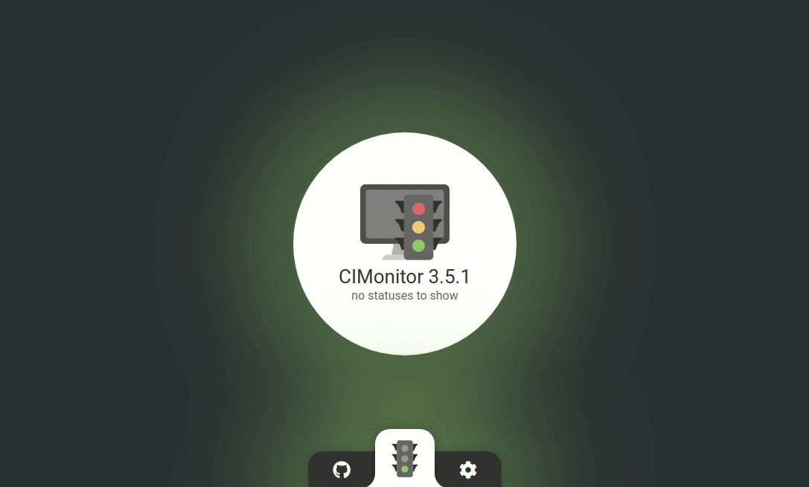

#  CIMonitor

[
    
    
    
    
    
](https://cimonitor.readthedocs.io)

CIMonitor is a place where all your CI statuses come together. Check if all tests have passed, and if
deployments are successful. All in one overview.

The time that deployments were scary is over, lets make them FUN!

## Features

-   Server application to process and handle all your statuses
-   An easy **API** to push **custom statuses**
-   **Real-time dashboard** of your statuses (deployments, pipelines, builds, ect!)
-   **GitLab web-hook endpoint** to push all **pipeline and build statuses** with ease!
-   **Travis CI web-hook endpoint** to push all **builds** with ease!
-   Support for a **master-slave** setup to have multiple computers listening to statuses
-   Modules that push hardware to represent your status and/or events:

| Philips hue light           | Marble run                   | Power up (beacon light)        |
| --------------------------- | ---------------------------- | ------------------------------ |
|  |  |  |

All modules are listed in [the documentation](https://cimonitor.readthedocs.io).

## Installation & documentation

All documentation on installation and setting up can be found in the online documentation at
[cimonitor.readthedocs.io](https://cimonitor.readthedocs.io).

## Requirements

In order to run the application you need:

-   `make`
-   `yarn`
-   `node`: version 8 or higher

## Local development

To start development run:

-   `make init`: The first time you want to run the project locally
-   `make dev-server`: Run the development server
-   `make dev-module-client`: Run the development server slave that listens to a development server
-   `make dev-client`: Run the dashboard application (restarts automatically when the front-end code changes)

Note: The server needs to run in order to display the dashboard.

## Running production

To start the production build:

-   `make build-production`: Creates all the files required for your production build

We recommend that you run the application with `pm2` so the application will restart if your computer reboots.
More on that in [the documentation](https://cimonitor.readthedocs.io).
