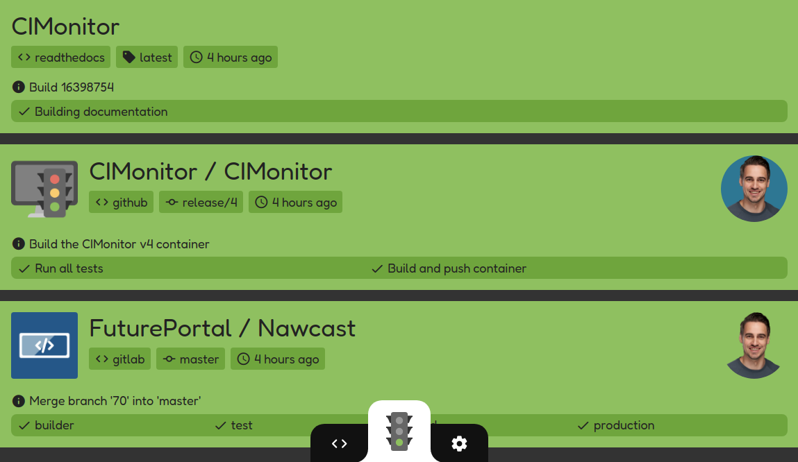
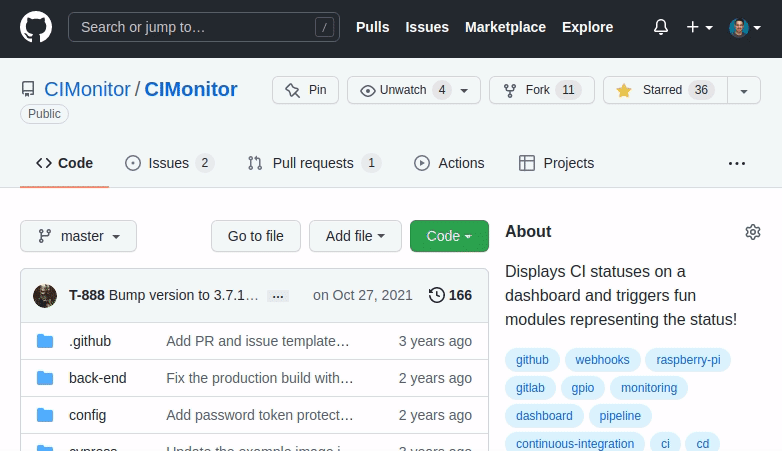
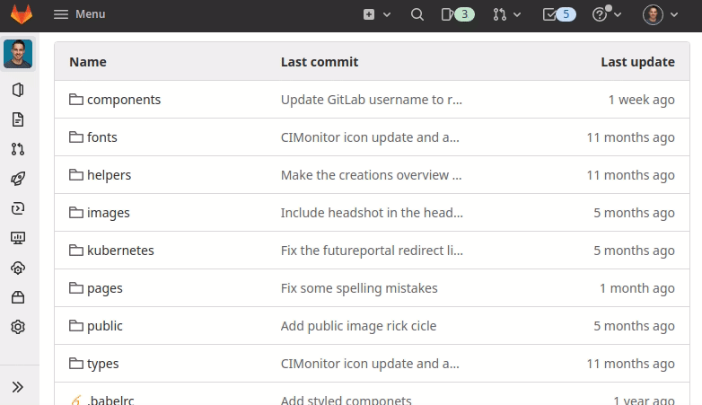

# [](https://cimonitor.readthedocs.io) CIMonitor

[](https://github.com/CIMonitor/CIMonitor/releases)
[](https://github.com/CIMonitor/CIMonitor/)
[](https://hub.docker.com/u/cimonitor/)
[](https://github.com/CIMonitor/CIMonitor/stargazers)
[](https://cimonitor.readthedocs.io)
[](https://travis-ci.org/CIMonitor/CIMonitor)

CIMonitor is a place where all your CI statuses come together. Check if all tests have passed, and if
deployments are successful. All in one overview. This is all done via **webhooks**, so no complex configuration.

The time that deployments were scary is over, lets make them FUN!



## Running CIMonitor

The easiest and quickest way to run CIMonitor is via docker. Running the command below will
start CIMonitor on [localhost:3030](http://localhost:3030):

```shell
docker run \
    --publish 3030:3030 \
    --detach \
    --restart unless-stopped \
    cimonitor/server:4.0.0
```

It is possible to run CIMonitor on Kubernetes too of course. See the docs how to do that.

## Connecting to GitHub / GitLab

CIMonitor is gathering its data from GitHub and GitLab webhooks. Those are VERY easy to configure. All you need is a
running CIMonitor URL. In the images below you can see how it's done.

### GitHub

Add webhook: `<your_cimonitor_url>/webhook/github`.



### GitLab

Add webhook: `<your_cimonitor_url>/webhook/gitlab`.



## Development

To start development, run the following commands on your terminal:

-   `make`: See all availabe make commands.
-   `make init`: The first time you want to run the project locally.
-   `make start`: Run the development server.
-   `make production`: Build and run a production build of the project.
