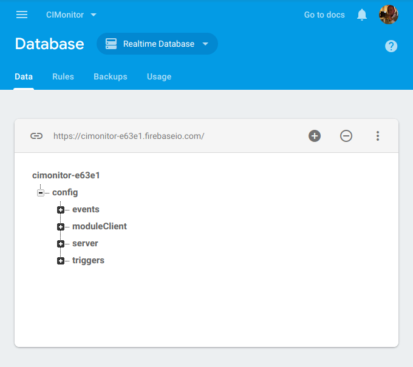

# Firebase

As an alternative storage to the local filesystem, Google Firebase can be used.

When Firebase is used, both the config and the CI statuses are stored in Firebase, so no local storage is needed.
This makes it possible to run the container on e.g. Kubernetes without losing state when upgrading or moving CIMonitor.

## Creating a database

Log in on [the Google Firebase console](https://console.firebase.google.com), and create a database by
clicking on New Project. Make sure to use the Realtime Database option instead of Cloud Firestore.

## Generating a private key

1. On the project overview, go to the cogwheel > Project settings > Service accounts.
1. Click `Generate new private key`, a JSON file will be downloaded.
1. Store this JSON file somewhere logical on your local machine, you need it later.

## Loading the config file

1. Go back to the database view of the realtime database, and on the root node click the `+` sign.
1. Create a node called `config` with a random value, then click on the config node.
1. Now click the dots menu > Import JSON, and pick the config.json file created earlier.

The final result should look something like this:



## Starting CIMonitor

CIMonitor needs three environment variables to connect to Firebase:

| environment variable        | description                                                |
| --------------------------- | -----------------------------------------------------------|
| `STORAGE`                   | Set this to `firebase` to make use of Firebase.            |
| `FIREBASE_URL`              | This url can be found above the database view in Firebase. |
| `FIREBASE_PRIVATE_KEY_FILE` | The location of the downloaded private key JSON file.      |

Prepend these environment variables before the command to start CIMonitor:

```
$ STORAGE="firebase" \
    FIREBASE_URL="https://cimonitor-12345.firebaseio.com/" \
    FIREBASE_PRIVATE_KEY_FILE="/path/to/firebase-private-key.json" \
    /opt/cimonitor/app/server.js
```

## Running the Docker container via Docker run

Simply pass on the environment variables to the docker container, like so:

```
$ docker run --name=cimonitor -d \
    -e STORAGE="firebase" \
    -e FIREBASE_URL="https://cimonitor-12345.firebaseio.com/" \
    -e FIREBASE_PRIVATE_KEY_FILE="/path/to/firebase-private-key.json" \
    cimonitor/server:latest
```

or pass them via your docker-compose.yml file.

## Running the Docker container on Kubernetes

When running CIMonitor on Kubernetes, a secret can be created:

```
$ kubectl create secret generic firebase-secrets \
    --from-file=firebase-private-key.json=/path/to/firebase-private-key.json
```

This secret can then be mounted inside the container:
```
kind: Pod
apiVersion: v1
metadata:
  name: cimonitor
  labels:
    name: cimonitor-prod
spec:
  volumes:
  - name: firebase-secrets
    secret:
      secretName: firebase-secrets
  containers:
  - name: server
    image: cimonitor/server:latest
    env:
    - name: STORAGE
      value: "firebase"
    - name: FIREBASE_URL
      value: "https://cimonitor-12345.firebaseio.com/"
    - name: FIREBASE_PRIVATE_KEY_FILE
      value: "/etc/firebase-secrets/firebase-private-key.json"
    volumeMounts:
    - name: firebase-secrets
      readOnly: true
      mountPath: "/etc/firebase-secrets"
```
