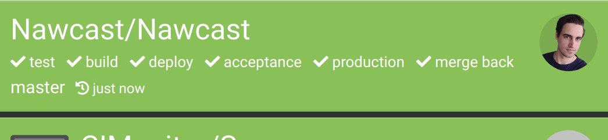
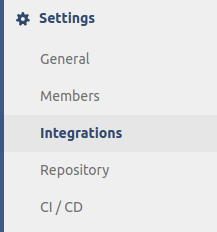
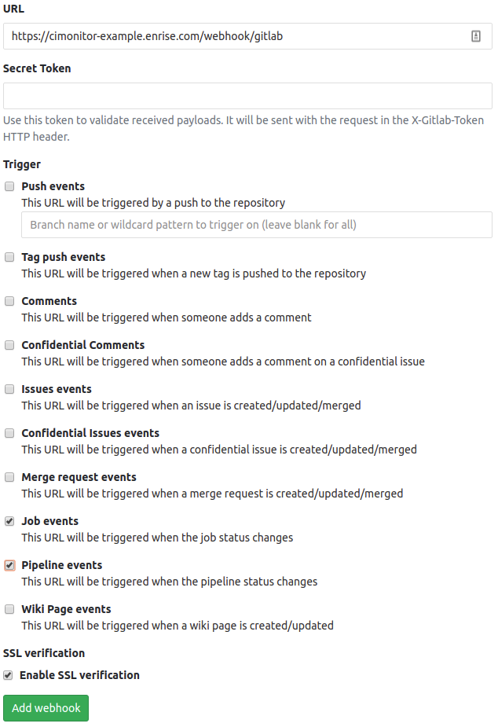
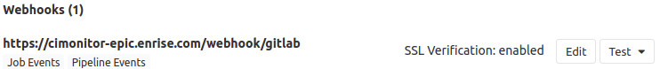
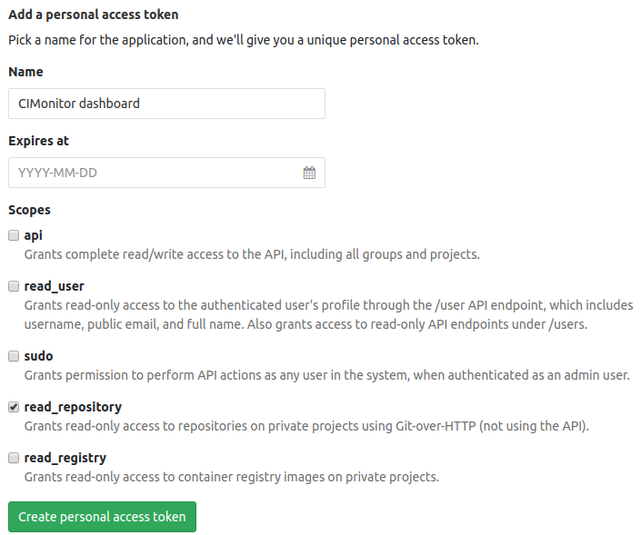

# GitLab



When you have your CIMonitor running, it's very easy to push your GitLab builds to the CIMonitor.

GitLab needs to push the webhook to the following endpoint on the CIMonitor: `/webhook/gitlab`

**Note:** GitLab can not push webhooks to your localhost! You need to expose your server address to
the public first. This can be done via [port forwarding](https://lmgtfy.com?q=port+forwarding).

## Setup webhook in GitLab

### Project settings

Open your project integration settings in GitLab:

> 

### Add webhook

Add the webhook as in the following example. Make sure you check the "pipeline" and "job" events.

> 

**Note:** Only check the "SSL verification" if your CIMonitor is running on https!

There is no support for a secret token.

### Finished webhook

> 

Now when you run a pipeline the statuses will be pushed to your CIMonitor!

## Private project avatars

In GitLab, you're not allowed to view project avatars for projects you don't have access to.
You can however provide a personal access token with `read_repository` permissions, so we can
load the project avatars in the dashboard.

### Create personal access token

In GitLab, when you go to your account settings, there is a page "Access Tokens". Here we need to
create the new personal access token like following:

> 

Click on the create button, and copy your new personal access token.

### Add to the CIMonitor config

Now you can add the personal access token to the CIMonitor config like following:

```json
{
    "server": {
        "personalAccessTokenGitLab": "---personal-access-token---",
```

Restart your application, and all new statuses pushed by the GitLab webhook will now show you
a project avatar!

**Note**: It will not show a project avatar if the user you used to create the personal access
token doesn't have access to that project.
