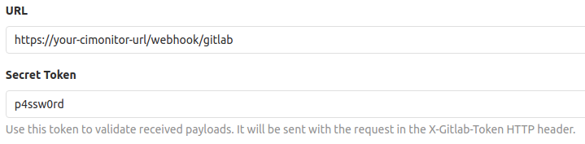

# Password protection

If you host your CIMonitor on the public internet, you want to use password protection. Without password protection
everyone is able to submit events to your CIMonitor, and remove them.

All status manipulating actions (adding, removing, editing) will require a password when set. Fetching the latest
statuses remains open. If you don't want that run the website internally instead.

## Set password in the config

In order to set a password, you need to provide it in the server section of you `config/config.json` file, like
below:

```json
{
    "server": {
        "password": "p4ssw0rd"
    },
```

It's up to you what password you use, just remember that it should be safe to use in a URL, and should not contain
weird characters.

## Submit password in API calls

There are multiple ways to provide the password to your API endpoints. The most clean and recommended way is to provide
an `Authorization` header in your request. The body of the header will be your password.

Alternatively, you can provide a token in the URL by appending `?token=p4ssw0rd` to the API url. This will also work
and lets you use the API.

## Submit password in the webhooks

Also the webhooks require the password to work. This can easily be done by adding `?token=p4ssw0rd` to the webhook
URL (replace with your actual password).

### GitLab webhook

When using the GitLab webhook, a cleaner method can be used than adding the token to the URL. GitLab itself allows you
to provide a secret token, which will be used in CIMonitor as your password. That will look like the following:

 
