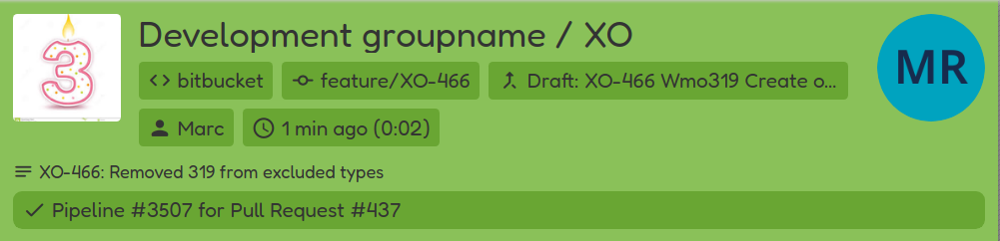

# BitBucket

## Adding webhook

In your BitBucket project settings, open the webhooks page, and add a webhook:

- _WebHook URL_: `cimonitor.example.com/webhook/bitbucket` (replace your domain name)
- _Content type_: `application/json`
- _Secret:_ insert the same password you've defined to access your settings
- _What event?_ Select all the events to unluck the most potential. Supported are merge request, pushes and builds.
- Make sure the webhook is active

Add your webhook! All new builds should become visible on your CIMonitor.
