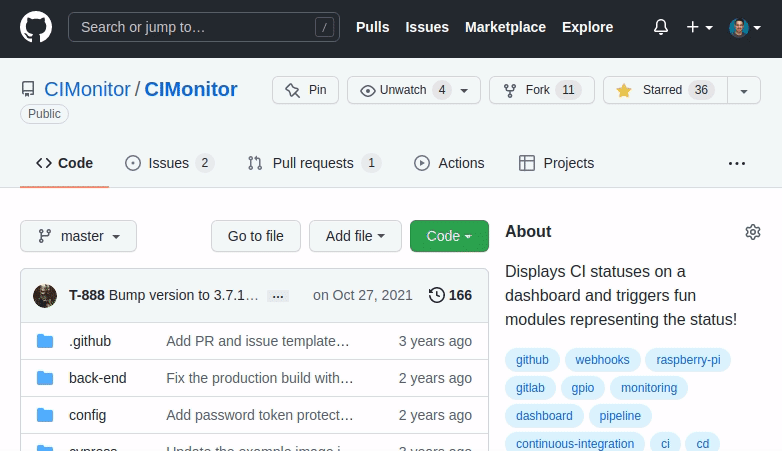

# GitHub

## Adding webhook

In your GitHub settings, open the webhooks section, and add a webhook as shown in the image below.

-   Payload URL: `cimonitor.example.com/webhook/github` (replace your domain name)
-   Content type: `application/json`
-   Secret: insert the same password you've defined to access your settings
-   What event? Send me everything!
-   Make sure the webhook is active

Add your webhook! All new builds should become visible on your CIMonitor.

