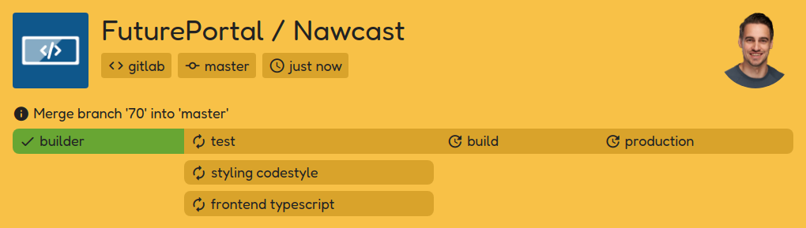
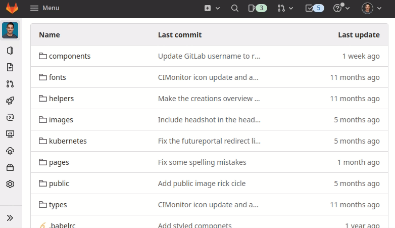

# GitLab

## Adding webhook

Open your project settings on GitLab. One of the setting pages is for webhooks specifically. Go to that page.

On the webhooks settings page, you can directly start filling in the details that are required for your webhook.

-   _URL_: `cimonitor.example.com/webhook/gitlab` (replace your domain name)
-   _Secret token:_ insert the same password you've defined to access your settings
-   _Trigger:_ Activate all the webhooks to have CIMonitor working at full potential
-   _SSL verification_: If you're running on `https` you want to enable this setting. Disable if your CIMonitor is
    running on `http`

Click "Add webhook"! All new builds should become visible on your CIMonitor.

## Demonstration

