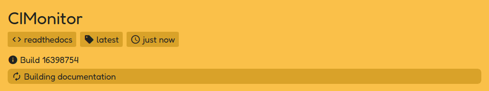
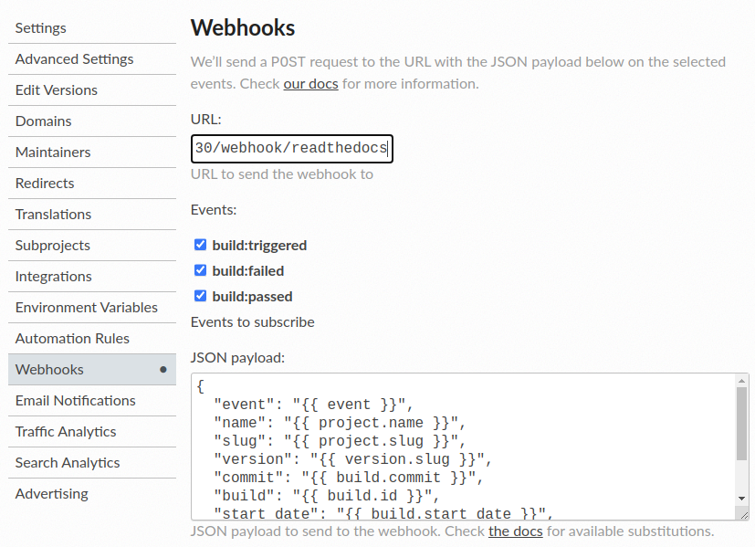

# Read the Docs

## Adding webhook

On Read the Docs, go to your project admin of the project you want to see statuses for. Go to the webhook page. here
you can add your webhook.

-   Enter your CIMonitor URL: `<your_cimonitor_url>/webhook/readthedocs`
-   Enable all events (build:triggered, build:failed, and build:passed)
-   Leave the default JSON. Note: changing the json will break your status.

Click save. All new builds should not become visible on your CIMonitor.
